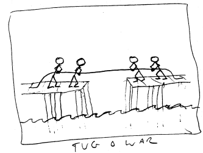
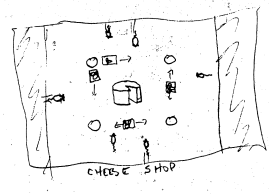
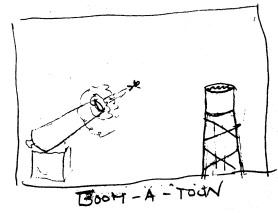
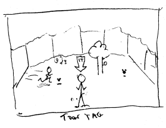
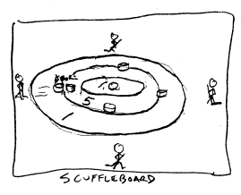
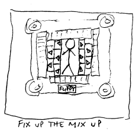
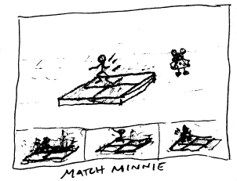
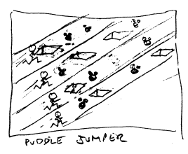
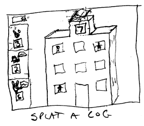

## 7 Designer'S Atlas 7.1 Overview 7.1.1 Neighborhoods

Toontown consists of nine neighborhoods.  Each neighborhood has a Safe Zone, or Playground
(where Cogs cannot enter) and streets where players may encounter Cogs.

In each Playground there will be an activity designed to provide simple entertainment for the players. This activity will also give the players an opportunity to heal themselves after a battle with the Cogs.

All Safe Zones have a Trolley Station.  It is here that players can access the trolley that will take them to the Mini-Games.

Each neighborhood will have the presence of one of six classic characters (Mickey, Minnie, Donald, Daisy, Goofy or Pluto. These characters will not interact with players but will be seen from a distance or in a working environment (i.e. driving the trolley).

## Safe Zones

There is a non-competitive activity available in each of these zones for players to amuse themselves. Each plaza is surrounded by a neighborhood themed after a Disney character.  (See Neighborhoods for detailed information).

## Cog Headquarters

Tougher gauntlets for advance players

## Building Interiors

Not all buildings can be entered.  Some have the highest level Cogs inside and can only be accessed by advanced players. Players will have to pass a series of "Assistant" Cogs to get to the head Cog.

7.1.2   Safe Zone 7.1.3 Streets 7.1.4 Tunnels 7.1.5 Landmark Buildings

## 7.2   Individual Maps

TBD - 3/30/01. This section should actually be removed, and the maps placed in the specfic neighborhood descriptions.

## 7.3

Description of all neighborhoods

## 7.3.1 Toontown Central

Toontown Central is themed like Toontown in Disneyland.  The center of town is a park-like atmosphere with lots of green trees and colorful houses.  In the center of the park is a gazebo and Players can walk around a Mickey-shaped hedge.  On the outskirts of the park are quaint cobbled-stone streets.  Mickey Mouse inhabits this neighborhood and it's here that the Hall of Fame and the Ritz Carltoon is located.

●
Fishing holes: There will be two small ponds for fishing. Players who walk up to the edge of the pond will enter "fishing mode", where they take out their fishing rods and begin fishing.

Fishing players who stand still will continue to fish. Moving your toon makes him put the fishing rod away, and exit fishing mode. The fishing sequence proceeds as follows:
TBD (2/28/01) - Should there be a "cast" and "exit" button for fishing instead?

cast them
•
●
wait reel them in
●
see what they caught::
●
●
Boot
(10% chance) (-1 fun meter points)
●
Nothing
(50% chance) (0 fun meter points)
Red fish
(25% chance) (1 fun meter point)
●
Blue fish (10% chance) (2 fun meter points)
.

●
Gold fish (5% chance) (5 fun meter points)
.

Repeat
●
Mickey NPC: Mickey will walk around the safe zone, in and out of buildings, on a set of prescripted paths. While Mickey is moving, if a player gets within eight feet of him, a message will be sent to the server, and if Mickey hasn't made a comment in the last ten seconds, he will make a comment chosen from a predefined list. Some comments will include the name of the player who got near him.

Comment list: (examples only. We need about 100 comments TBD 3/15/01)
"Nice day, isn't it?"
"Hi, <name>!"
"Watch out for the cogs!"
"Welcome to Toontown Central!"
"Have you seen Minnie?"
"The trolley is right on time!"
Optional behavior: If Mickey actually collides with a player, he will stop walking, and wait until his path is not blocked, making comments every ten seconds.

●
Hero statue: There will be a hero statue in the safe zone.

'ur
.

Deluxe trolley station: The trolley station here will be larger than the others, but function the same way.

## 7.3.2  Donald'S Dock

A lake dominates this neighborhood and in its center is a red, white and blue boat, owned by Donald Duck. The streets are made of wooden planks and the buildings have a wharf theme to them.  In the middle of the lake sits an island that players can visit.  Players can go underwater in this neighborhood and play catch with fish that swim nearby.

.

Boat: Donald's boat sails in a circle around the safe zone, alternately stopping at each of the two docks. When the boat pulls up at a dock, the dock-ramp comes up. When the boat leaves, the dock-ramp goes down. Players on the boat can walk freely about on it. While on the boat, players will receive one fun meter point every minute.

●
Swimming: Players can walk off the edge of the dock to enter the water, with a "splash" effect. When in the water, they assume a swimming animation. Controls operate as normal, but the characters will swim at a fixed height in the water, though bobbing up and down for effect. There should also be fog and bubble effects under the water. When players swim to the dock-ramps or the island, they should assume a walking animation again, so they can walk back up above the surface. While swimming, players will receive one fun meter point every minute.

●
Sunken treasure: Small treasure chests will occasionally (one every two minutes or so, never more than one present at a time) appear in random locations under the water. Players who swim up to them will collect them, and be rewarded with 5 fun meter points.

●
Donald NPC: Donald pilots the boat. He doesn't walk around, but keeps his place behind the ship's wheel. He makes comments depending upon the state of the boat.

Boat is waiting for people to board:
●
(examples only. We need about 12 comments. TBD 3/15/01)
"Hurry up and get on! We're leaving soon" "Come on, come on!"
.

Boat is leaving:
.

(examples only. We need about 12 comments. TBD 3/15/01)
"All aboard!"
"Here we go!"
Boat is in transit:
(examples only. We need about 25 comments. TBD 3/15/01)
"Ahhh ... What a beautiful day." "Hey! Don't rock the boat!"
Boat arrives at dock:
(examples only. We need about 12 comments. TBD 3/15/01)
"Everybody off!" "Here we are!"
.

## 7.3.3 The Brrrgh

A winter wonderland is the theme of The Brrrgh.  It snows all the time here and all the buildings have icicles hanging from their roofs. In this neighborhood everything is frozen and the sky is always overcast. The pond in the middle of this neighborhood is frozen over and players will have a slippery time of trying to walk from one end to the other while trying to catch falling snowflakes. If they're successful and catch the oversized flakes, they will improve their Laugh Meter. Pluto watches over this neighborhood and can be seen trying to paw his way around the ice to get back to his igloo/dog house.

Skating: Walking onto the ice causes toons to assume "ice physics". This works as follows:
●
The "forward" control (up arrow, or top-screen mouse click and hold) will give the character forward acceleration, and the "backward" control will give the opposite, up to a max velocity limit in each direction. Characters will always move in the direction they are facing. While toons skate, they receive one fun meter point per minute.

●
Snowflake Gathering: About once every ten seconds, a giant snowflake will drift down from the sky at a random location on the ice, very slowly. When it touches the ground, it will disappear. Players who can gather the snowflake while it is in midair will get five fun meter points. Ice holes: There will be holes in the ice, and players who fall in will cause a splash effect, and then pop out of the water in a large ice cube, which will land on shore. One of four spots where ice cubes can land will be chosen randomly. While encased in ice, toons cannot move or animate. However, their collision sphere will remain on, so that other players can push them around. If one frozen player collides with another, both of their ice cubes will disappear with an "ice cracking" sound effect, and both will get their freedom of movement restored. Also, if a frozen player is pushed out onto the ice, they will become similarly unfrozen.

Players not freed in this way will remain encased in ice for 20 seconds before the ice cube fades away, and freedom of movement is restored.

.

Ice fishing: Inside the igloo, there is a "special" ice fishing hole. Instead of falling in, players will fish at it, similarly to how they can fish in Toontown Central, except that when the "boot" comes up, it will be frozen in an ice cube.

.

Pluto: Pluto will run around and bark in a humorous, out-of-control, slipping and sliding way on the ice, occasionally bumping into players. His algorithm picks one of several predetermined points on the ice, and he runs there in a straight line, then picks another point, etc. When he runs along one of these line segments, he should run for the first half, and then slip, slide, and spin as he decelerates the rest of the way. He can fall into an ice hole, just like the other toons can, and similarly can be frozen in a block of ice, if one of his paths terminates at the ice hole.

Hero Statue: There will be a hero statue in the safe zone, that appears to be made of ice.

## 7.3.4

# Minnie'S Melody Land

Everyone knows how much Minnie loves music and this neighborhood is designed so players can enjoy it too. Buildings are decorated with musical notes and some even resemble oldfashioned juke-boxes. Players can jump and slide around keyboard bridges and base drum walkways. There are golden horns that shoot up into the air that players can climb into and jump out of. In the center of the Safe Zone is a revolving keyboard that changes pace and tune as players jump on the nearby drums and keyboards.

Dancing: When toons stand on the drum, keyboard, or horn platforms, they will go into a
●
"dance" animation. While dancing, they will receive 1 fun meter point per minute.

●
Spotlight: Occasionally, (once every two minutes), a spotlight will appear over one of the platform for a period of thirty seconds. Players on the spotlight platform will receive 1 fun meter point every five seconds. Minnie dances to the music. She doesn't walk around, but keeps her place on the dance floor.

●
She makes occasional comments (every 10-30 seconds).

Minnie's occasional comments:
(examples only. We need about 50 comments. TBD 3/15/01)
"La-la la-la la-la!"
"Have fun dancing!" "Looking good!"
"Welcome to Melodyland!"
"If you see Mickey, tell him I say hello!"
2.55

## 7.3.5  Goofy Stadium

And they're off and running at Goofy's Stadium where it's sports events 24/7.  Themed like a large stadium there's a dirt racetrack where players can participate in competitions.

.

Racetrack (option 1 TBD 2/28/01): While standing on the racetrack, players can run at faster speeds than normal. Red, blue, and gold olympic-style medals appear randomly. Gathering the medals gives 1, 2 or 5 fun meter points respectively. One medal appears every thirty seconds, for a max of five medals.

.

Racetrack (option 2 TBD 2/28/01): Walking up to the start of the track puts the player into "race mode" ... The toon toes up to the line, a starting pistol is fired, and a visible numeric clock starts counting time as the player runs around the track. Running is a challenge because several tortoises are wandering around on the track (oh yeah? Can you think of something better?). Tripping over the tortoises slows down the player. When you get to the end of the course, you will get health meter points based on how well you did. A scoreboard of best times of the day is prominently featured.

●
Goofy: (option 1 TBD 2/28/01): Goofy jogs around the track, making random comments. If players get nearby, he might use their name, etc., etc.

•
Goofy: (option 2 TBD 2/28/01): Goofy fires the starter pistol for the race, and tells you your finish time.

## 7.3.6 Daisy Garden

Daisy Duck welcomes you to her pretty neighborhood filled with pastel colored flowers.  The Victorian/gingerbread buildings are covered with crawling vines and flower boxes and bowers decorate walkways. A wall of lollypop trees circle the neighborhood.  You can hear the sounds of birds chirping and fountains spraying water as you wander through the gardens.  There are no concrete sidewalks in this neighborhood, because Daisy keeps her place decorated with lush grass and hedges.  Players can find their way through a large hedge maze to find the yellow and white daisy in the middle.  Once they step into the large daisy it closes it petals and heals them from any damage done during battles. Once their Laugh Meters are improved they are transported to the outskirts of the maze and ready to explore some more.

· Hedge Maze: A prominently featured hedge maze will be in place here.

- Pickable flowers: Flowers will pop up at random all over the safe zone. (One every ten seconds, twenty flowers max in the zone). Gathering a flower rewards players with one fun meter point.

Butterflies will flutter around the safe zone, purely for visual interest. They should not fly where toons can walk through them.

- Giant Flower: At the center of the safe zone is a giant flower. One guest at a time may walk into the giant flower. When they do, the flower petals will close around them, and their fun meter will be boosted by forty points. At this point the flower will "spit" them into the air, and they will land safely outside the hedge maze.

.

Daisy: Daisy walks around on a set of predetermined paths, occasionally watering with her watering can. While Daisy is moving, if a player gets within eight feet of her, a message will be sent to the server, and if Daisy hasn't made a comment in the last twenty seconds, she will make a comment chosen from a predefined list. Some comments will include the name of the player who got near her.

Comment list: (examples only. We will need about 100 comments. TBD 3/15/01)
"Isn't the garden looking nice?"
"What's your favorite kind of flower, <name>?"
"Don't get lost in the hedge maze!"
"Last time Donald was here, he got stung by a bee!"
Optional behavior: If Daisy actually collides with a player, she will stop walking, and wait until her path is not blocked, making comments every twenty seconds.

Hero Statue: A hero statue will be featured somewhere in the safe zone.

## 7.3.7 Funny Farm

Themed after a 20's black and white cartoon, this barnyard style neighborhood looks like a cartoon pencil drawing.  Buildings of silos, stables and storefronts line the neighborhoods. Players play tag with a hay baler that can "trap" them temporarily in hay if they are not careful.

Banjo music plays in the background and the scene will appear occasionally with an "old film scratch look." A modern day black and white Mickey calls this neighborhood his.

•
Chickens: Ten chickens move about at random, occasionally laying eggs (about 1 egg appears every 30 seconds, max of 3 eggs simultaneously). The eggs are red, blue, or gold, and worth 1, 2, or 5 fun meter points. Optional chicken behavior: Chickens flee players who get too close, and will only lay eggs when not being harassed.

Fishing: There is a fishing hole that works just like the one in Toontown Central.

.

Mickey: Mickey sits by the pond with a fishing pole, and fishes like the other players. He makes comments based on the state of his fishing.

Waiting for a bite: (examples only. We will need about 100 comments. TBD 3/15/01)
"Nice day for fishing!"
"Where have all the fish gone?"
"Hope I catch a big one!"
"Sssh ... Don't scare the fish."
Upon making a catch: (examples only. We will need about 50 comments. TBD 3/15/01)
"Hey! I got something!"
"What's this?" "I hope it isn't another boot!"

## 7.3.8 Dreamland

It's nighttime in this neighborhood and everything is designed for quiet and comfort.  The sun never rises and its pillowed shrubs and fluffy trees add a cozy feel to the streets. Players can bounce on a gigantic bed and catch happy stars floating above them. The sky is full of billowing clouds that take the shape of swans and sheep.  Players can find Donald Duck dressed in his nightshirt and cap sleep walking across the Safe Zone.  The buildings have muted light coming from behind shuttered windows.  In the background you can hear clocks quietly chiming and in the distance someone is snoring.

●
Trampoline: The center of the safe zone is themed like a large quilt, which acts as a trampoline. Toons automatically enter "jump mode" when standing on the trampoline. In jump mode, your character will jump higher, and higher each time they touch the ground, until the maximum jumping height is reached. Toons can still be "steered" as normal in the XY plane. Landing off of the quilt causes a toon to return from "jump mode" back to "walk mode."
•
Floating Stars: Above the trampoline "magic stars" float in lazy circles. The stars can be gathered by the jumping players. Red stars are lowest, and give 1 fun meter point, blue stars are in the middle, and give 2 fun meter points, Gold stars are highest, and give 5 fun meter points. A new star appears once every 20 seconds, until the max of 12 stars is reached.

●
Donald: Donald sleepwalks around on a set of predetermined paths. Every thirty seconds, he makes a talks in his sleep.

Comment list: (examples only. We will need about 50 comments. TBD 3/15/01)
"ZZZZZZ"
"Zzzzz… hello, Mickey… zzzzzz…"
"Zzz… uh oh … zzz…"
"Zzz ... What's that bouncing noise? Zzz ... "
"Zzz ... Mmm, apple pie ... zzz ... "

## 7.3.9 The Construction Zone

This neighborhood is under constant construction and there's lots of work left to do.   Goofy is trying to renovate, but just never seems to get it finished.  The neighborhood is littered with work tools and machinery and the buildings are half-finished. There's a lot of work to be done in this neighborhood.

Girder Maze: A tricky 3D girder maze is in the center of the scene. Ramps lead up from the
●
ground to the girders on the first floor. Some girders are on crane hooks, and move from place to place, sometimes from floor to floor, which is how players can get to higher floors. The maze has three floors, with red lunchboxes on the first floor, blue lunchboxes on the second floor, and gold lunchboxes on the third floor, worth 1, 2, and 5 fun meter points, respectively. Falling off the girders causes a toon no harm, but puts you back on the ground floor.

Goofy: Goofy is operating the crane. He makes comments every minute or so.

Comments: (examples only. We will need about 50 comments. TBD 3/15/01)
"Lots of work to do!" "Whew! This is hard work."
"Where did I leave my lunchbox?"
"I don't know if this place will ever get built."
7.4    Difficulty Levels TBD
Headquarters 7.5 TBD
 Vault 7.6 TBD

## 9.3 List Of Mini-Games

 9.3.1 Lucky Number

Lucky Number is themed like a board game. Up to four players can play.  If there are less than four players, the remaining slots are taken by Cogs. The game board has four parallel game tracks of equal length, one for each player. Each turn, each player picks a number from 1 to 4, from a dice-themed number picker. If a player chooses a unique number, the player advances that many spaces. If the player chooses the same number that someone else has chosen, the player stays in place. Some spaces have a "?" on them, and players who end their move on a "?"
space will have a "?" card drawn from a deck visible on the game board. The following table indicates the cards, and their frequencies:

| "?" cards               | Frequency   |
|-------------------------|-------------|
| Forward l               | 10%         |
| Forward 2               | 10%         |
| Forward 3               | 10%         |
| Forward 5               | 10%         |
| Back l                  | 10%         |
| Back 2                  | 10%         |
| Back 3                  | 10%         |
| Instant winner!         | 10%         |
| Everyone else forward 3 | 10%         |
| Everyone else back 3    | 5%          |
| Everyone else back 5    | 5%          |

The first player to get to the end of the track is the winner. Points are awarded for 1*, 2°d, 3°d, and 4th place.

## 9.3.2 Tug-O-War

Tug-o-war has a nautical theme, like the Donald's Dock neighborhood. The game is played on 

two oppositely facing piers. Each team tries to pull the opposite team into the water. There are several variations, and one will be randomly chosen based on the number of players:
●
One player 0 Player on one side, cog on the other.

.

Two players O Two players on one side, two cogs on the other O One player on each side
.

Three players Three players on one side, three cogs on the other o One enlarged player on one side, two players on the other o 
●
Four players Four players on one side, four cogs on the other o Three players on one side, one enormous player on the other O
Two players on one side, two players on the other o Players make small circles with the mouse. The faster the circles, the faster the pull. An onscreen pull meter will be shown over each Toon's head to give feedback about the efficacy of the pulling. If, after a time limit, neither side has won, then one of two things happens at random:
A - All players are declared victorious.

B - Both piers collapse, dumping all players into the water, so all players lose.

If the players have not been pulling hard enough, option A will be chosen.

The winning players split the pot of points. The losers each get a small amount of consolation points.

9.3.3 CHEESE SHOP

## Theming: Tbd 4/15/01

The game is played from an overhead view. A large wheel of cheese sits in the center of the screen, surrounded by four pillars. When there are four players, each player uses their mouse to control a sliding blocker with their Toon's face on it that can slide from one pillar to another.

The tracks for the four sliding blockers form a square that surrounds the cheese. When the game begins, little mice run in from the four sides of the screen, heading towards the cheese. Players use their blockers to block the mice from getting there. Deflected mice flee the scene. Mice that get by the blockers take a bite of the cheese, and run off. Each bite of the cheese causes it to get a little bit smaller. When time is up, the cheese is weighed, and the players evenly split points based on the amount of cheese that is left. There is enough cheese that the mice can't eat it all, so the players always get some points.

When there are less than four players, walls will block the sides where there are no players, and mice will only come from the appropriate directions.

9.3.4 BOOM-A-TOON

Theming: TBD 4/15/01 One to four (based on the number of players) large cannons point at four water towers. Each time the game is played, a random height is chosen for the towers, and the towers are a random distance away. Players are given the opportunity to adjust the vertical inclination of their cannon, and the amount of powder used to fire it. Once all players have made their selections, the Toons each climb into their respective cannons, and the cannons are fired, causing the Toons to fly toward the towers. Toons that miss the target will crash comically into it or the ground, with their legs protruding and flailing, and they will receive a small number of consolation points. Toons that land in the water towers will land with a splash. Each tower has a target painted on the bottom of it's pool, and points will be given based on how close to the center of the target each Toon came.

## Theming: Tbd 4/15/01

This game takes place in an "arena" where Toons can run around freely, as they can in the main game. There are tokens scattered around the arena, and the goal of the game is to gather as many as you can. As the tokens are gathered, new ones appear in random locations. One player is initiallly chosen randomly to be "it". The "it" player is unable to gather tokens. If "it" tags another player, that player becomes "it", and the former "it" can now gather tokens. Play continues  until time is up. Points are awarded based upon the number of tokens gathered. Even a player who gathers no tokens gets a small number of consolation points. When there are less than four players, AI Toons will be added to make for four players.

## 9.3.6 Scuffleboard

Theming: TBD 4/15/01 Four Toons stand evenly distributed around a large target on the ground. Each player takes a turn trying to slide a puck out onto the target. Players may freely set the angle they will send their pucks, but the puck's velocity is set by a velocity meter that oscillates up and down in a cycle.

Whereever it is when the player clicks sets the velocity of the puck. Pucks can collide with other player's pucks, knocking them to other places on the target, or off of it entirely. Each player gets a turn one at a time, then the process is repeated, for a total of eight pucks.

When there are less than four players, AI Toons will be added to make for four players.

Points are awarded for 156, 2nd, 3rd, and 4th place.

## 9.3.7 Dodge-A-Cog

Theming: TBD 4/15/01 (Perhaps garden themed with a hedge maze? Perhaps cubicle themed?)
This game is basically a pac-man style game for up to four players. The goal is to run around a maze (perspective is isometric) avoiding cogs, and gathering tokens. If you touch a cog, you get paralyzed for about ten seconds. Players get points based on how many tokens they gathered. If the group manages to gather all the tokens before time is up (60 seconds), they each get special bonus points.

## 9.3.8 Fix Up The Mix Up

Theming: TBD 4/15/01 We see a randomly generated Toon, with a sign that says "Match this Toon". The Toon is onscreen for about three seconds, and then replaced with the create-a-toon interface. Players
: /
have 15 seconds to use the interface to create the identical Toon. When time is up, the Toons that each player created are shown side by side, and points are split among all those players who created the identical Toon. Players who failed to do so will receive a small number of consolation points.

## 9.3.9 Match Minnie

Theming: TBD 4/15/01 (Hopscotch? Drums? Keyboard?)
This game is based on the old "Simon" electronic game. Minnie hops out a sequence on four drum heads. Players use the mouse to click on the drum heads to get their Toon to repeat the sequence. If the player chooses the wrong sequence, or does not complete the sequence in the allotted time, they are "out." If the player succeeds at matching the sequence, Minnie hops out a longer one. Play continues until only one player remains (in the case of 2-4 players) or in the case of a single player, until that player is out.

Points are awarded for 1st, 2nd, 3rd, and 4th place.

9.3.10 PUDDLE JUMPER

Theming: TBD 4/15/01 (Ice skating theme)
This is a jumping game. Players skate side by side on parallel tracks. Clicking the mouse makes the player jump. (It would be nice to have a velocity control too... right mouse button? Arrow keys?) There are tokens to gather on the track (snowflakes), and holes in the ice. Players who fall in the ice are frozen in a cube of ice for a short period. The game ends when time is up. Points are awarded based on the number of tokens collected.

## 9.3.11 Splat-A-Cog

This is a version of Whac-a-mole that takes place on the side of a building. Cogs and Toons alternately pop up in the open windows. Clicking on them with the mouse throws a pie toward that window. Points are awarded for hitting a cog, and subtracted for hitting a Toon. Other players' game boards (if any) are not shown, but other players scores are updated in real time.

## 9.3.12 Splat Attack

SPLAT
The players (one to four) are arranged in a semi circle around several pop-up cog targets. Each Toon is manning a pie-throwing machine. The machine oscillates from left to right and right to left. Players click the mouse to throw a pie, which goes in whatever direction the machine is pointing at that moment. Players have twenty pies and twenty seconds. Players get points each time they hit one of the targets.